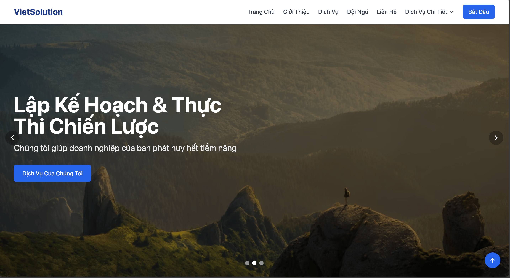
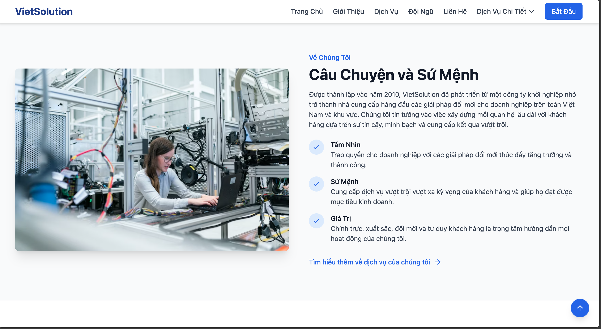
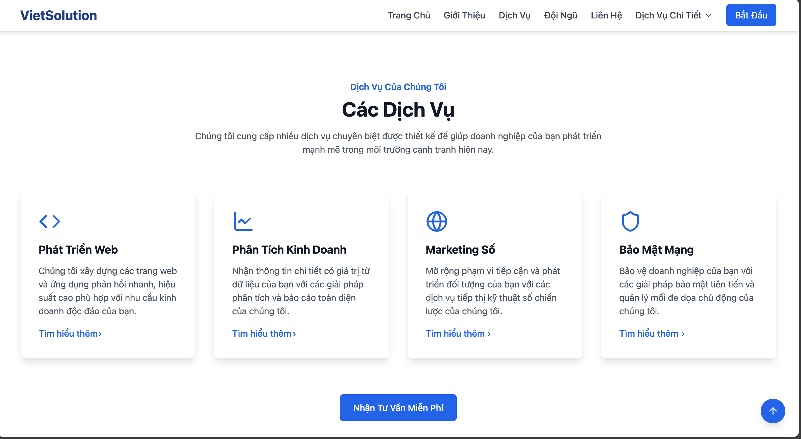
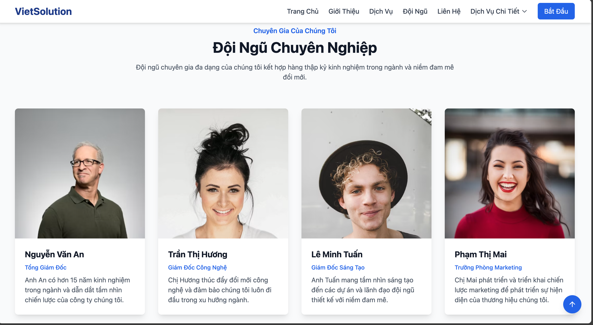
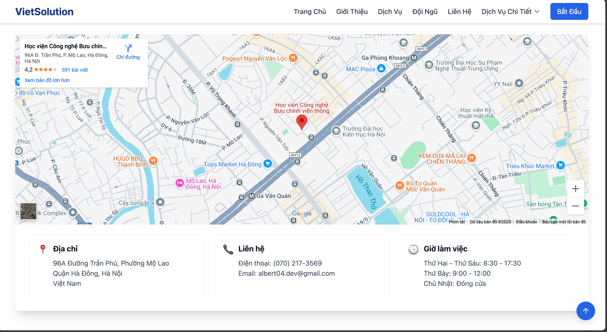
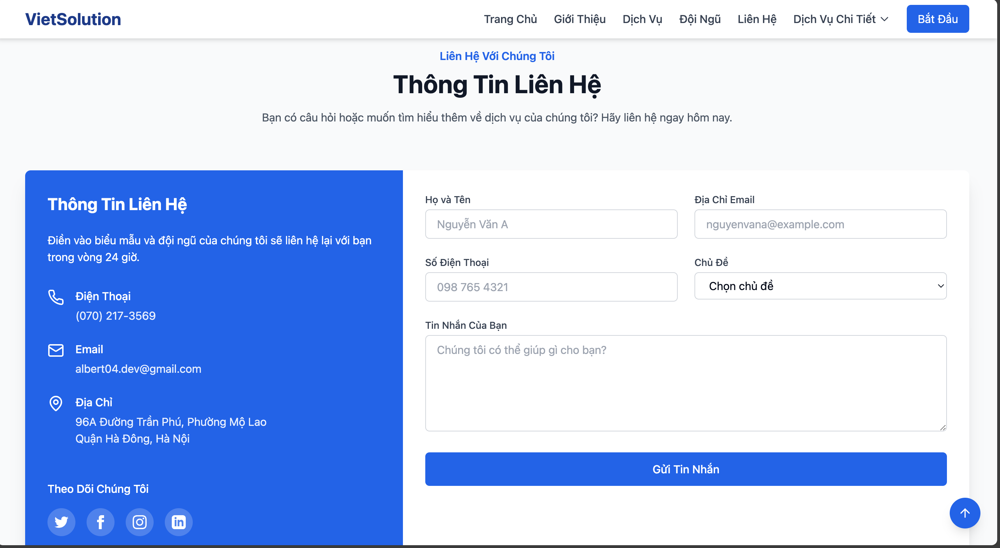

# Viet Solution - Company Website

[](https://opensource.org/licenses/MIT)

This repository contains the source code for the Viet Solution company website, showcasing professional IT solutions for businesses.

**Live Project URL**: [https://company-website-eosin-five.vercel.app](https://company-website-eosin-five.vercel.app) (Managed via Vercel)

## ✨ Features

- **Responsive Design**: Adapts to various screen sizes (desktop, tablet, mobile).
- **Service Pages**: Detailed information about core offerings:
  - [Web Development](src/pages/WebDevelopment.tsx)
  - [Business Analysis](src/pages/BusinessAnalysis.tsx)
  - [Digital Marketing](src/pages/DigitalMarketing.tsx)
  - [Cyber Security](src/pages/CyberSecurity.tsx)
- **Interactive Components**: Includes a hero carousel, team showcase, contact form, and map integration.
- **Policy Pages**:
  - [Privacy Policy](src/pages/PrivacyPolicy.tsx)
  - [Terms of Service](src/pages/TermsOfService.tsx)
  - [Cookie Policy](src/pages/CookiePolicy.tsx)
- **Smooth Scrolling & Animations**: Enhanced user experience with smooth navigation and subtle animations using Framer Motion.

## 📸 Screenshots

Here's a glimpse of the Viet Solution website:

**Hero Section:**


**About Us Section:**


**Services Section:**


**Team Section:**


**Contact Form:**


**Contact Map & Info:**


## 🚀 Technologies Used

- **Frontend Framework**: [React](https://reactjs.org/)
- **Build Tool**: [Vite](https://vitejs.dev/)
- **Language**: [TypeScript](https://www.typescriptlang.org/)
- **UI Components**: [shadcn/ui](https://ui.shadcn.com/)
- **Styling**: [Tailwind CSS](https://tailwindcss.com/)
- **Animations**: [Framer Motion](https://www.framer.com/motion/)
- **Routing**: [React Router DOM](https://reactrouter.com/)
- **Form Handling (Contact)**: [EmailJS](https://www.emailjs.com/)
- **State Management (Toasts)**: Custom hook ([`use-toast.ts`](src/hooks/use-toast.ts))

## 🛠️ Getting Started (Local Development)

To run this project locally, follow these steps:

1.  **Prerequisites**: Ensure you have [Node.js](https://nodejs.org/) (which includes npm) installed. Using [nvm](https://github.com/nvm-sh/nvm#installing-and-updating) is recommended.

2.  **Clone the repository**:
    ```sh
    git clone https://github.com/albert2704/Company-Website.git
    cd Company-Website
    ```
3.  **Install dependencies**:

    ```sh
    npm install
    ```

    _(Or `npm i`)_

4.  **Run the development server**:
    ```sh
    npm run dev
    ```
    This will start the Vite development server, typically available at `http://localhost:5173`. The server features Hot Module Replacement (HMR) for instant updates.

## 🔧 Available Scripts

- `npm run dev`: Starts the development server.
- `npm run build`: Builds the application for production.
- `npm run lint`: Lints the codebase using ESLint.
- `npm run preview`: Serves the production build locally for preview.

## ✏️ How to Edit

- **Local IDE (like VS Code)**: Clone the repo, make changes, commit, and push.
- **GitHub**: Edit files directly on GitHub or use GitHub Codespaces.

## 📞 Contact

**Viet Solution**

- **Email**: albert04.dev@gmail.com
- **Address**: Quận Hà Đông, Hà Nội

## 📄 License

This project is licensed under the MIT License - see the [LICENSE](LICENSE) file for details (if one exists, otherwise consider adding one).
